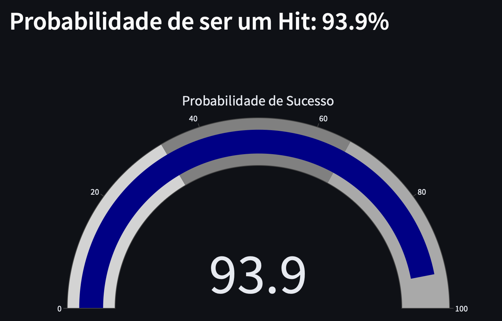
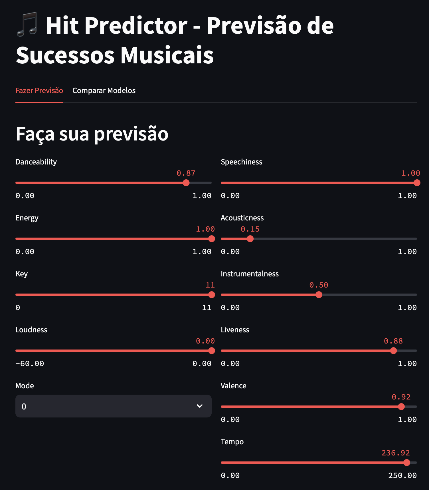

# 🎵 Hit Predictor - Previsão de Sucessos Musicais


Um modelo de machine learning que analisa características musicais para prever o potencial de sucesso de uma música. O projeto foi treinado exclusivamente com dados de playlists premium do Spotify que contêm hits mundiais, incluindo:

- 🏆 Top 50 Global
- 🌎 Today's Top Hits
- 🚀 Viral 50 hits
- ⭐ Global Top Ever
- 🎵 Hot Hits Global

## ⚡ Acesso Rápido

🌐 **[Acessar Aplicação Online](https://music-hit-predictor-htvysmmfpg9dupkyst9aks.streamlit.app/)**

[](https://music-hit-predictor-htvysmmfpg9dupkyst9aks.streamlit.app/)

[Ver Código Fonte](https://github.com/MelloBirkan/music-hit-predictor)

## 🎯 Sobre o Projeto

O Hit Predictor utiliza três modelos de machine learning diferentes para analisar características musicais como danceability, energia, tempo e outras métricas do Spotify para prever a probabilidade de uma música se tornar um sucesso. 

### Principais Características:

- 📊 Interface interativa para testar diferentes características musicais
- 🔄 Comparação em tempo real entre três modelos de predição:
  - Random Forest
  - Gradient Boosting
  - Regressão Logística
- 📈 Visualização detalhada das métricas de performance de cada modelo
- 🎵 Dataset exclusivo com hits mundiais do Spotify

## 📋 Índice

- [Sobre o Projeto](#-sobre-o-projeto)
- [Funcionalidades](#-funcionalidades)
- [Tecnologias Utilizadas](#-tecnologias-utilizadas)
- [Estrutura do Projeto](#-estrutura-do-projeto)
- [Como Executar](#-como-executar)
  - [Usando Docker](#usando-docker)
  - [Instalação Local](#instalação-local)
- [Demonstração](#-demonstração)
- [Pipeline de Dados](#-pipeline-de-dados)
- [Modelos e Performance](#-modelos-e-performance)
- [Contribuições](#-contribuições)
- [Licença](#-licença)

## 🎯 Sobre o Projeto

O Hit Predictor é uma aplicação que utiliza machine learning para analisar características musicais e prever a probabilidade de uma música se tornar um sucesso. O projeto coleta dados do Spotify, processa as informações e treina diferentes modelos de classificação para fazer previsões precisas.



## ✨ Funcionalidades

- 🎵 Coleta automática de dados do Spotify
- 📊 Pré-processamento e normalização de features musicais
- 🤖 Treinamento de múltiplos modelos de ML
- 📈 Interface web interativa para previsões
- 📊 Visualização de métricas e comparação de modelos
- 🔄 Pipeline automatizado de dados

## 🛠 Tecnologias Utilizadas

- Python 3.9+
- Scikit-learn
- Pandas
- NumPy
- Streamlit
- Plotly
- Docker
- Spotify API

## 📁 Estrutura do Projeto

```bash
hit-predictor/
├── src/
│ ├── data_collection.py # Coleta dados do Spotify
│ ├── data_preprocessing.py # Prepara os dados
│ ├── model_training.py # Treina os modelos
│ └── app.py # Interface Streamlit
├── data/ # Dados brutos e processados
├── models/ # Modelos treinados
├── assets/ # Imagens e recursos
├── Dockerfile
├── docker-compose.yml
├── requirements.txt
├── start.sh
└── README.md
```

## 🚀 Como Executar

### Usando Docker

1. Clone o repositório:
```bash
git clone https://github.com/MelloBirkan/music-hit-predictor.git
cd music-hit-predictor
```

2. Execute com Docker Compose:
```bash
docker-compose up --build
``` 


3. Acesse a aplicação em `http://localhost:8501`


### Instalação Local

1. Clone o repositório:
```bash
git clone https://github.com/MelloBirkan/music-hit-predictor.git
cd music-hit-predictor
```

2. Crie um ambiente virtual:
```bash
python -m venv venv
```

3. Instale as dependências:
```bash
pip install -r requirements.txt
```


4. Execute o script de inicialização:
```bash
bash start.sh
```


5. Acesse a aplicação em `http://localhost:8501`

## 🎮 Demonstração

### Interface Principal


### Previsão de Hits


### Comparação de Modelos


## 🔄 Pipeline de Dados

1. **Coleta de Dados**
   - Conexão com API do Spotify
   - Extração de features musicais
   - Armazenamento de dados brutos

2. **Pré-processamento**
   - Limpeza de dados
   - Normalização de features
   - Engenharia de features

3. **Treinamento**
   - Random Forest
   - Gradient Boosting
   - Regressão Logística


## 📊 Modelos e Performance

O projeto utiliza três modelos diferentes de classificação, cada um com suas características específicas:

### Random Forest
- Melhor para capturar relações não lineares complexas
- Robusto contra overfitting
- Métricas:
  - AUC-ROC: 0.98
  - Precisão: 0.73
  - F1-Score: 0.84

### Gradient Boosting
- Excelente performance em features numéricas
- Aprendizado sequencial adaptativo
- Métricas:
  - AUC-ROC: 0.96
  - Precisão: 0.87
  - F1-Score: 0.73

### Logistic Regression
- Modelo base para comparação
- Boa interpretabilidade
- Métricas:
  - AUC-ROC: 0.93
  - Precisão: 0.48
  - F1-Score: 0.65

### Comparação Visual dos Modelos
